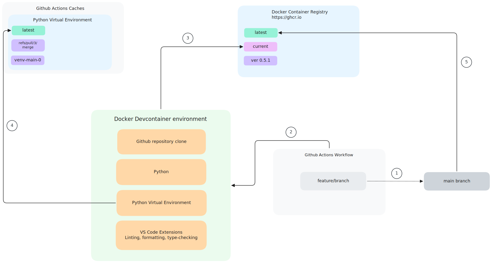

# Easily setup devcontainer and base Github actions workflows on it

## Introduction

This repository has a small yet instructive project that shows you how to create a devcontainer for developing on Codespaces and how to base the GitHub actions workflows on it.

Specifically, the project is a simple Python app whose dependencies are managed by [Poetry](https://python-poetry.org/).

* It contains some simple tests (for example purposes) that are run with pytest.
* It uses black, ruff, and mypy for linting, formatting, and type checking.
* Finally, it has two Github actions workflows for:

    1. linting, formatting, and type checking.
    2. running the tests with pytest.

## Setup

### Configure Github actions permissions

* The Docker login action `docker/login-action@v3` should be able to pull and push container images to and from the registry. To do this, we need to create a personal access token with the minimum required scope (respecting the principle of least privilege).
* In this project, I used a personal access token (classic) (see [official docs on how to create one here](https://docs.github.com/en/authentication/keeping-your-account-and-data-secure/managing-your-personal-access-tokens#creating-a-personal-access-token-classic)).

  * Once you have created the token, copy its value and paste it into a repository secret (e.g. a secret named `GH_DEVCONTAINER_TOKEN`). [See the official documentation on how to create secrets for a repository](https://docs.github.com/en/actions/security-for-github-actions/security-guides/using-secrets-in-github-actions#creating-secrets-for-a-repository).

  * Next, select the minimum scopes required for this personal access token:

    * `write:packages`
    * `read:packages`

### Building and reusing the devcontainer in a workflow

To create and reuse a cached container image for faster workflow runs, we are using the convenient action [`devcontainers/ci@v0.3`](https://github.com/devcontainers/ci). We specify where to fetch the image from using the `imageName` input, which accepts an URL of the following form ``ghcr.io/NAMESPACE/IMAGE_NAME:latest``. The namespace is typically the github account name under which the repo exists and the image name is the repository name (read more about it [in the official docs](https://docs.github.com/en/packages/working-with-a-github-packages-registry/working-with-the-container-registry#pushing-container-images)).

## Scenarios

### 1. Merge a feature into the main branch with a pull request (PR)

1. Check out a feature/branch from the main branch.
2. Spin off a devcontainer to work on that new feature.
3. Devcontainer gets the latest container image _cached_ from the container registry.
4. Devcontainer gets latest Poetry virtual environment from cache.
5. When PR is merged into main branch, a _new_ latest devcontainer image is pushed to the registry, which will be used for future version developments.

Note that in step 3, the devcontainer is not rebuilt, but reused from the latest cached version.

### 2. Open a PR with a new feature

Similar to scenario 1, but pushing new devcontainer image is _skipped_ because the code changes are not merged to main ([see specification of](https://github.com/devcontainers/ci/blob/main/docs/github-action.md#inputs) `push` and `eventFilterForPush` inputs for `devcontainer/ci` action).

### 3. Add new Python libraries to the list of existing dependencies

If we were to add a new Python library as part of our development, in step 4 of scenario 1 we would not get the virtual environment from the cache, but we would use the newly created one with the additional library and _push_ it to the cache.