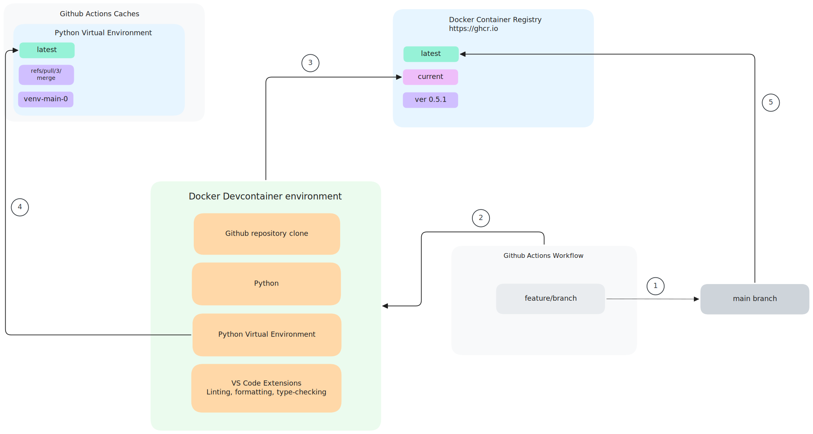

# How to setup a devcontainer for a poetry-based Python project and base Github Actions workflows on it

### Introduction

This repository contains a small example project that shows how to create a devcontainer and base the Github Actions workflows on it.

Specifically, the project is a simple Python project whose dependencies are managed by Poetry.

* It contains some simple tests (for example purposes) that are run with pytest.
* It uses black, ruff, and mypy for linting, formatting, and type checking.
* Finally, it has two Github Actions workflows:

    1. one workflow for linting, formatting, and type checking
    2. a second workflow for running the tests with pytest

#### Flowchart showing the process of merging a feature into the main branch with a Pull Request

1. Check out a feature/branch from the main branch
2. Spin off a devcontainer to work on that new feature
3. Devcontainer gets the latest container image _cached_ from the container registry
4. Devcontainer gets latest Poetry virtual environment from cache
5. When PR is merged into main branch, a _new_ latest devcontainer image is pushed to the registry, which will be used for future version developments

Note that in step 3, the devcontainer is not rebuilt, but reused from the latest cached version.